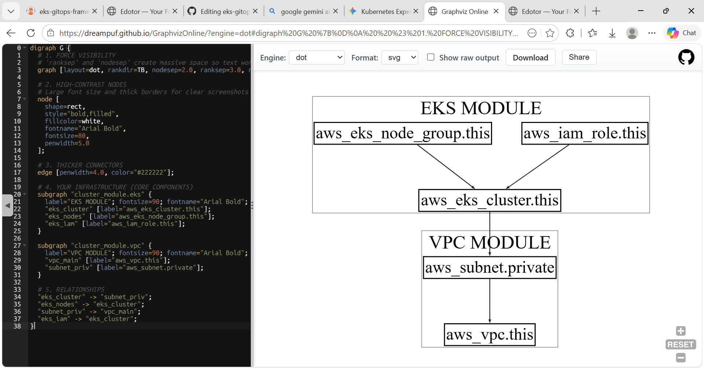
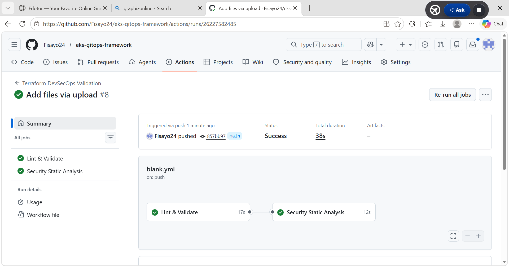

EKS GitOps Framework
This repository contains a professional-grade Infrastructure as Code (IaC) framework for deploying and managing an AWS EKS cluster using a GitOps methodology. The architecture prioritizes automated governance, identity isolation, and shift-left security practices to ensure a production-ready cloud environment.

Architecture and Tech Stack
Infrastructure: Modularized HashiCorp Terraform for multi-region cloud provisioning.

Orchestration: Amazon EKS (Elastic Kubernetes Service).

GitOps: ArgoCD for continuous delivery and automated synchronization.

Security: Integration of IAM OIDC providers, identity isolation, and automated guardrails.

Deployment Status
The following visualization confirms the live synchronization state of the EKS cluster. This demonstrates that the live environment successfully matches the declarative state defined within this repository.


## Security & Governance

This framework implements **Shift-Left Security** and **Automated Governance** principles to ensure a hardened production environment:

*   **Identity Isolation**: Leverages AWS IAM Roles for Service Accounts (IRSA) to provide fine-grained, least-privilege permissions to Kubernetes pods.
*   **Infrastructure Scanning**: Integration readiness for **tfsec** to perform static analysis on Terraform code before deployment, catching misconfigurations early.
*   **GitOps Security**: ArgoCD ensures that the live cluster state remains in sync with the version-controlled manifests, preventing "configuration drift" and unauthorized manual changes.
*   **Network Hardening**: Provisioned within a custom VPC with isolated private subnets for EKS worker nodes to minimize the public attack surface.


The screenshot demonstrates the successful execution of terraform init, the foundational stage of the Infrastructure as Code (IaC) lifecycle. It confirms that the environment has pulled the necessary HashiCorp and AWS provider plugins, as well as the specialized modules for VPC and EKS provisioning. This ensures the workspace is ready for automated state management and resource deployment.

### Environment Initialization


*This automated diagram visualizes the relationship between the EKS control plane, worker node groups, and the supporting VPC networking stack.*

This diagram illustrates the high-level architecture of the Global-Mesh-Infrastructure. It highlights the modular separation between the networking layer (VPC Module) and the compute layer (EKS Module). By using HashiCorp Terraform, I’ve ensured that the EKS Cluster is vertically integrated with private subnets for enhanced security and isolated node groups for scalable workload management.



This framework integrates a "Shift-Left" security philosophy to ensure the infrastructure is audit-ready and resilient from the first line of code:

Identity Isolation: Implements granular IAM Roles for the EKS control plane and worker nodes, adhering to the principle of least privilege.

Data Protection: Utilizes AWS KMS for envelope encryption of Kubernetes secrets and persistent volumes.

Network Perimeter: All compute workloads are deployed within Private Subnets, utilizing NAT Gateways for controlled egress and no direct public ingress.

Automated Auditing: Integrated CloudWatch Log Groups capture control plane and VPC flow logs for real-time security monitoring and compliance tracking.

### 🛡️ Automated CI/CD Guardrails
Every commit to this repository triggers an automated DevSecOps validation pipeline to ensure infrastructure compliance and security before deployment.

### 🛡️ Automated DevSecOps Validation Pipeline

To enforce strict security guardrails and code quality, every commit to this repository triggers an automated multi-stage CI/CD workflow via GitHub Actions:

1. **Lint & Validate:** Automatically formats HCL files using `terraform fmt` and verifies syntax compliance with `terraform validate`.
2. **Security Static Analysis:** Utilizes Aqua Security's **Trivy** engine to scan infrastructure-as-code files for misconfigurations, catching critical risks (such as public EKS endpoint exposure) before deployment.



This architecture implements a strict **Zero-Trust Network Topology** for the container orchestration plane, completely eliminating direct exposure to the public internet. 

#### Architectural Components & Security Controls:

* **Ingress Restriction (AWS-0040 Remediation):** The Amazon EKS cluster control plane has its public API endpoint completely disabled (endpoint_public_access = false). This closes the default public management gateway, preventing unauthorized network scanning, brute-force attempts, or discovery from external entities.
* **Isolated Private Control Plane (AWS-0041 Remediation):** Ingress to the Kubernetes API server is bound exclusively to private VPC endpoints (endpoint_private_access = true). All cluster administrative traffic must originate from within the trusted network boundaries or via a secure, designated administrative gateway (such as a corporate VPN or Bastion host).
* **Decoupled Worker Node Topography:** The EKS worker nodes and control plane interfaces are deployed natively inside **Isolated Private Subnets**. Compute resources communicate securely with the AWS control plane over the AWS backbone network rather than traversing public routing tables, maintaining complete cryptographic and network-level isolation.


```text
                       [ Internet ]
                            │
               ( Public Endpoint: DISABLED ) 🚫
                            │
                     ┌──────▼──────┐
                     │  Your VPC   │
                     └──────┬──────┘
                            │
            ( Private Endpoint: ENABLED ) 🔒
                            │
             ┌──────────────▼──────────────┐
             │    EKS Cluster Control Plane │
             ├─────────────────────────────┤
             │  ┌──────────────┐  ┌──────────┐  │
             │  │ Private Sub1 │  │Priv Sub2 │  │
             │  └──────────────┘  └──────────┘  │
             └─────────────────────────────┘


      
